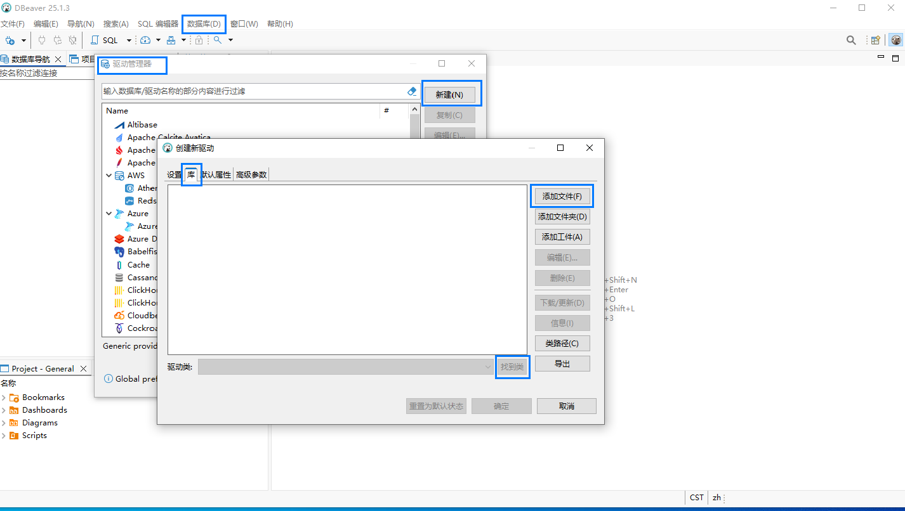
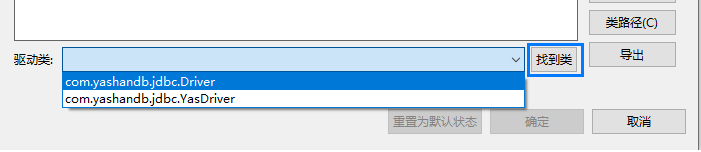
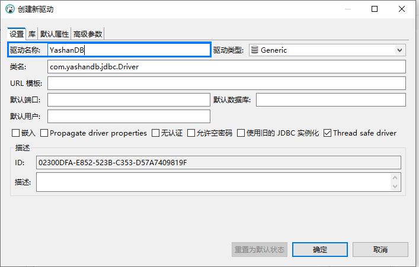
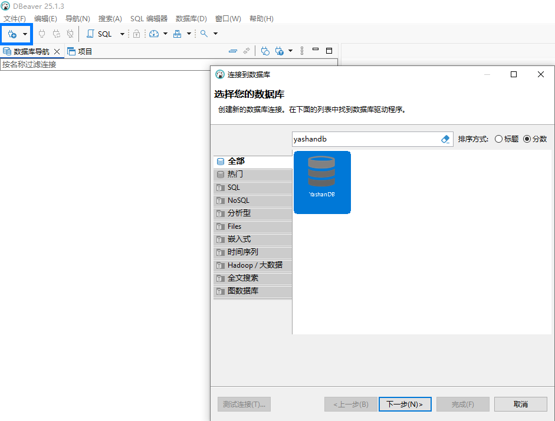
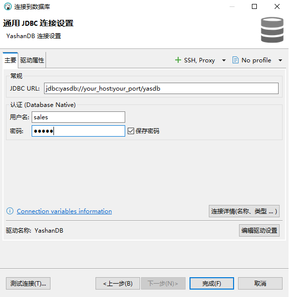
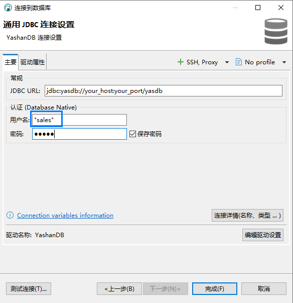
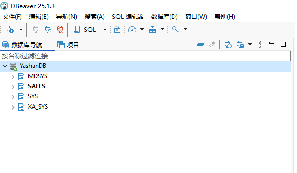
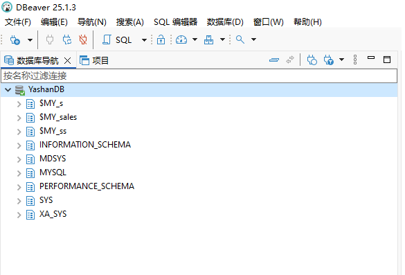

DBeaver是一款免费开源的跨平台数据库管理工具，支持多种类型的数据库连接，在该工具中载入YashanDB提供的JDBC驱动包后，可以实现对YashanDB各部署形态，及各兼容模式形态的服务端连接和操作。本文将对此对接过程进行介绍。

## 对接前准备

在进行对接操作前，您需要先准备好如下事项：

1. 已安装DBeaver工具
2. 已在[YashanDB官网下载中心](https://download.yashandb.com/download)下载YashanDB JDBC驱动包
3. 已存在一个可正常访问的YashanDB服务端。

## 对接配置

请参照如下步骤进行YashanDB与DBeaver的对接配置：

1. 从DBeaver工具的菜单中，选择【数据库 > 驱动管理器】
2. 在弹出的窗口中点击【新建】按钮
3. 在弹出的窗口中选择【库 > 添加文件】，将YashanDB JDBC驱动包加入到驱动管理器中

4. 文件添加后，上图中的【找到类】将变的可用，点击它，从弹出的驱动类中选择`com.yashandb.jdbc.Driver`

5. 继续在此窗口，切换到【设置】页，可以看到上一步选择的类名已出现在这一页中，为新驱动命名，例如`YashanDB`

6. 点击【确定】，至此YashanDB JDBC驱动已成功对接到DBeaver工具中。

## 使用简介

完成上述对接配置后，即可以开始在DBeaver工具中连接和操作YashanDB，本文将简单举例进行介绍：

1. 从DBeaver工具的菜单中，选择【数据库 > 新建数据库连接】
2. 在弹出窗口中，下拉或者搜索找到对接配置中新建的驱动名称，选择它

3. 点击【下一步】，进入连接信息配置页面，输入如下信息：

   - JDBC URL：格式为'jdbc:yasdb://your_host:your_port/yasdb'，请将your_host和your_port替换为您的YashanDB服务端IP（多实例形态如YAC，选择其中一个IP），和该IP上的DB监听端口（默认安装情况下为1688）
   - 用户名：YashanDB中已创建并拥有合适权限的用户名称，请注意当连接的YashanDB处于mysql模式时，除sys外的用户名称前后需加上双引号
   - 密码：YashanDB用户的密码

   ::: tabs

   == YashanDB

== YashanDB（mysql模式）

:::

4. 点击【测试连接】，输出成功连接信息时，表示连接设置成功
5. 点击【完成】退出连接设置窗口，在【数据库导航】界面将会看到新建的连接，下拉它，成功展示YashanDB相关信息说明已成功连接到YashanDB，开发者可以开始输入SQL语句操作YashanDB。

::: tabs

== YashanDB

== YashanDB（mysql模式）

:::
